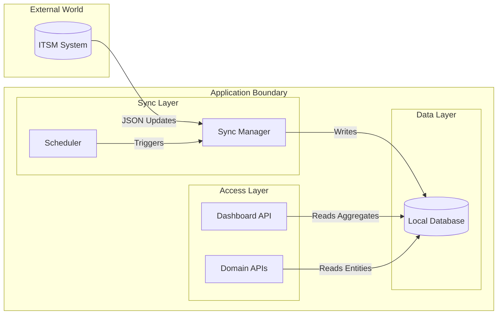
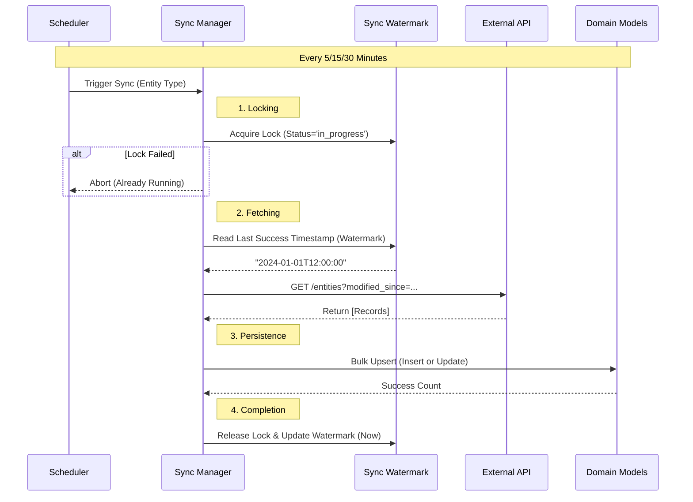
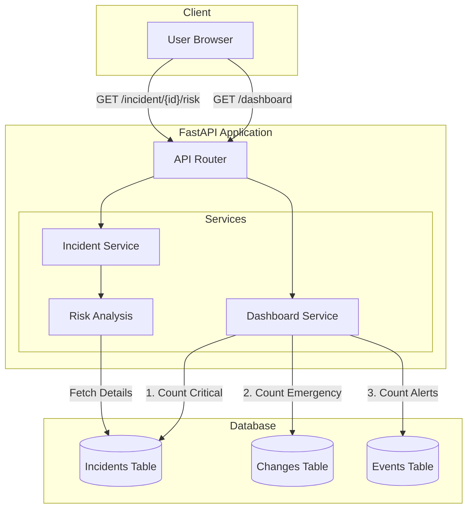

# Synchronization Architecture

This document describes the architecture of the data synchronization process between the external ITSM system and the local application cache, as well as how this data is consumed by the API.

## Overview

The application implements a **Active Caching / Mirroring** pattern using a **Watermark-based Incremental Sync**.

1.  **Writes**: Primarily happen in the external ITSM system (System of Record).
2.  **Sync**: A background scheduler periodically fetches updates from the external system and updates the local database.
3.  **Reads**: The API serves read requests directly from the local database (low latency), decoupling consumers from the external system's performance and availability constraints.

### Core Concept: Watermark
We utilize a **Watermark** (`last_success_at`) to track the state of our synchronization with an external source of authority.

```
Watermark: 2024-01-15 14:20:00
API Call:  GET /incidents?modifiedSince=2024-01-15T14:20:00Z
Result:    Upsert 47 records → Update watermark to NOW()
```

## System Architecture

The following diagram illustrates the high-level relationship between the components. The **Sync Service** handles the data ingestion pipeline, while the **Consumers** (Dashboard, APIs) read from the local cache.



## Detailed Workflows

### 1. Synchronization Process
This diagram details the "Write Path": how data moves from the External API into the Local Database.



### 2. Read / Consumption Process
This diagram details the "Read Path": how consumers access the data without touching the external API.



## Database Schema

### Sync Watermarks (`sync_watermarks`)
Controls the state of the sync jobs. One row per entity type.

| Column | Type | Description |
|--------|------|-------------|
| `entity_type` | PK | `incident`, `change`, `event` |
| `last_success_at` | Timestamp | The "Watermark" for next API call |
| `status` | Enum | `success`, `failed`, `in_progress` |
| `consecutive_failures` | Int | Circuit breaker metric |

### Domain Caches (`incidents`, `changes`, `events`)
Local mirrors of external data.
- **Identity**: `external_id` (PK) maps to Source UUID.
- **Sync Meta**: `external_modified_at`, `local_synced_at`.
- **Business Data**: `priority`, `state`, `risk`, etc.

## Component Breakdown

### 1. Sync Scheduler (`app/infrastructure/sync/scheduler.py`)
Responsible for orchestration. It uses `APScheduler` to trigger jobs on defined intervals:
-   **Incidents**: Every 5 minutes.
-   **Changes**: Every 15 minutes.
-   **Events**: Every 30 minutes.
-   **Reconciliation**: Weekly (Sunday 2 AM) to catch deleted records.

### 2. Sync Manager (`app/infrastructure/sync/manager.py`)
Handles the core synchronization logic. This layer is purely infrastructure ("Get the data here") and does not know about domain logic (e.g., what "High Risk" means).

-   **Locking**: Ensures only one sync job runs per entity type using database locks.
-   **Incremental Sync**: Fetches only records modified since the last successful sync (`SyncWatermark`).
-   **Upsert**: Uses efficient bulk operations to insert new records or update existing ones in the local DB.
-   **Reconciliation**: Identifies records deleted in the source (but present locally) and marks them as soft-deleted (`is_deleted=True`).

### 3. Domain Models & Services (`app/domain/`)
The domain layer focuses on "Using the data". It is unaware of the sync scheduler or external API.

-   **Persistence**: SQLAlchemy models acting as the local cache schema.
-   **Logic**:
    *   **Incident Service**: Calculates risk based on priority & state.
    *   **Change Service**: Identifies conflicts and emergency changes.
    *   **Event Service**: Correlates alerts to impact scores.

### 4. API Consumers (`app/interfaces/api/`)
FastAPI endpoints that consume the local data:
-   **Dashboard**: Provides a "Single Pane of Glass" view by aggregating critical data from Incidents, Changes, and Events in one query.
-   **Domain APIs**: Provide standard listing and specific business logic.

## Configuration & Deployment

### Runtime Switching
Controlled via `.env`:
*   `DB_TYPE=sqlite`: Uses `sqlite:///./app.db`. Enables WAL mode automatically for concurrency.
*   `DB_TYPE=postgres`: Uses standard connection pool.

### Startup Sequence
1.  **FastAPI Lifespan** triggers.
2.  `database.init_db()`: Checks/Creates tables.
3.  `scheduler.start()`: Loads jobs into APScheduler.

### Observability
*   **Health Endpoint**: `/api/v1/health/sync` returns status of all watermarks.
*   **Logs**: Stdout logging for sync start/finish and error traces.
